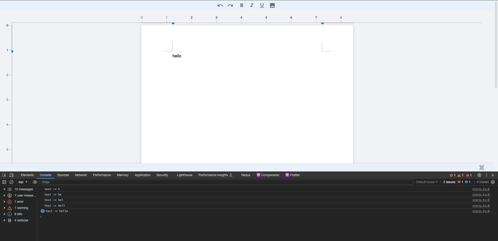
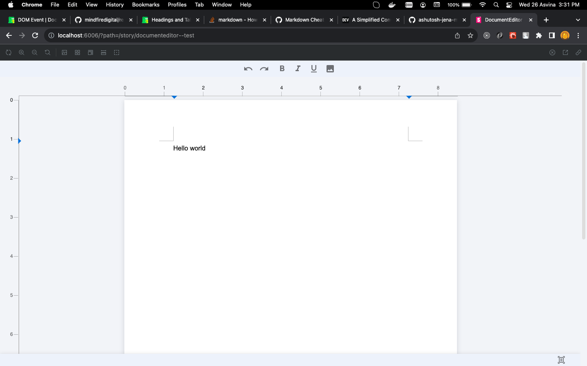

# How to use DOM events

Mastering the handling of DOM events is crucial for effective React development. Below are key events and how to use them:
## Retrieving Page Value

**onChange**: This event triggers when the value of an input page changes.

```javascript
export const test = () =>{
    
const handleChange = (data) => {
  console.log('test ->',data);

}

return ( 
        <DocumentEditor 
            onChange={handleChange} 
        />
    )
}
```

## Capturing Selected Text

**onSelect**: This event activates when text on the page is selected.

```javascript
export const test = () =>{

const handleSelectedText = (text) => {
  console.log(text);

}
    return ( 
        <DocumentEditor 
            onSelect={handleSelectedText}
        />
    )
}
```

## Setting Page Value
**value**: To assign a value to an input page, use the value attribute.
```javascript
export const test = () =>{
        return ( 
        <DocumentEditor 
            value="Hello world"
        />
    )
}
```



By following these steps, you can proficiently work with DOM events in React, enhancing your application's functionality.